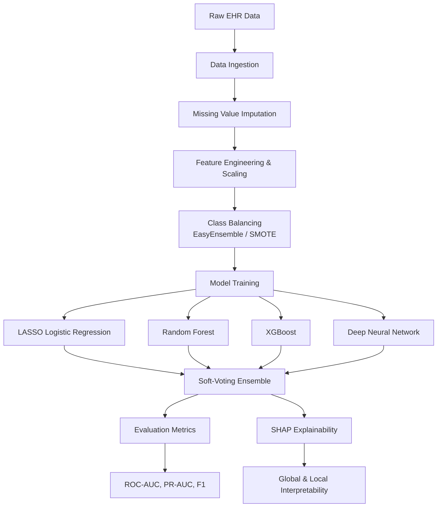

# EHR Depression Prediction Framework

An end-to-end, production-grade machine learning framework for predicting incident depression from Electronic Health Records (EHR). Designed for clinical AI researchers and healthcare data scientists, this repository synthesizes high-performance predictive modeling with rigorous explainable AI (XAI) to ensure clinical transparency.

[](https://python.org)
[](https://pytorch.org)
[](https://xgboost.ai/)
[](https://github.com/slundberg/shap)

[]()

---

## Overview

Depression is a profound and escalating global healthcare challenge, often underdiagnosed in primary care settings until severe symptoms manifest. Electronic Health Records (EHR), containing longitudinal patient histories including demographics, diagnostic codes (ICD-9/10), and care utilization metrics, offer a rich, untapped predictive data source for early identification.

However, clinical translation of machine learning requires more than predictive accuracy; it demands interpretability. Black-box algorithms face substantial adoption barriers in healthcare due to the inability to explain *why* a specific diagnosis risk is assigned. 

This framework establishes a comprehensive, reproducible methodology to predict future depression diagnoses from structured EHR data. It integrates multiple robust algorithms—from penalized logistic regression to gradient-boosted trees and deep neural networks—stabilized by ensemble voting, and demystified through state-of-the-art Shapley Additive exPlanations (SHAP). 

---

## Key Features

| Feature | Description |
|---------|-------------|
| **EHR Prediction Pipeline** | End-to-end data ingestion, missing value imputation, and robust evaluation specifically designed for noisy clinical datasets. |
| **LASSO Logistic Regression** | Custom PyTorch implementation incorporating L1 regularization to ensure sparsity and inherent interpretability. |
| **Random Forest** | Scikit-learn integration providing robust, non-linear ensemble tree baselines. |
| **XGBoost** | High-performance gradient boosted decision trees optimized for tabular EHR modeling. |
| **Deep Neural Networks** | PyTorch Multi-Layer Perceptron (MLP) architecture capturing complex, high-order clinical interactions. |
| **Ensemble Learning** | Soft-voting algorithmic consensus mechanism merging outputs across disparate model families to reduce variance. |
| **SHAP Explainability** | Clinical transparency via local (waterfall) and global (summary) feature importance attribution. |
| **EasyEnsemble Balancing** | Advanced handling of severe clinical class imbalances utilizing undersampling and SMOTE integration. |
| **Publication-Quality Evaluation** | Automated generation of stringent clinical ML metrics (PR-AUC, ROC-AUC) and visualization outputs. |
| **Modular Architecture** | Configuration-driven (Hydra), extensible framework supporting rapid deployment of novel clinical models. |

---

## System Architecture



---

## Repository Structure

```text
├── configs/               # Hydra YAML configuration management
│   └── config.yaml        # Centralized hyperparameter and path definitions
├── datasets/              # Data storage and synthetic generation
│   └── mock_data.py       # Generator for testing pipeline mechanics
├── evaluation/            # Quantitative assessment methodologies
│   ├── holdout_eval.py    # Independent test set evaluation protocol
│   └── metrics.py         # Clinical metric calculation (AUROC, AUPRC)
├── explainability/        # Model interpretability 
│   └── shap_utils.py      # SHAP integration for global/local explainability
├── models/                # Mathematical algorithm definitions
│   ├── ensemble.py        # Soft-voting algorithmic aggregation
│   ├── lasso.py           # L1-penalized PyTorch regression
│   ├── mlp.py             # Multi-Layer Perceptron architecture
│   ├── rf_model.py        # Random Forest implementation
│   └── xgboost_model.py   # Gradient boosted tree implementation
├── preprocessing/         # Data engineering and transformation
│   ├── features.py        # Extraction and standard scaling
│   ├── imputation.py      # Missing clinical data resolution
│   ├── ingestion.py       # Robust dataset loading
│   ├── sampling.py        # EasyEnsemble and SMOTE imbalance handlers
│   └── splitting.py       # Deterministic train/validation/test partitions
├── scripts/               # Orchestration
│   └── run_pipeline.py    # Primary entry point for pipeline execution
└── tests/                 # Continuous integration and validation
    └── test_pipeline.py   # Pytest suite for data integrity and model logic
```

---

## Dataset Design

The pipeline is engineered to ingest structured, longitudinal EHR data formatted as flat tabular files (e.g., CSV). A synthetic data generator is provided to facilitate immediate execution.

| Feature | Type | Description |
|---------|------|-------------|
| **Age** | Continuous | Patient age at the time of prediction. |
| **Sex** | Categorical (Binary) | Biological sex (0 = Male, 1 = Female). |
| **Visit Frequency** | Continuous | Total number of clinical encounters over a predefined lookback period. |
| **ICD9 Count** | Continuous | Aggregate volume of historical ICD-9 diagnostic codes. |
| **ICD10 Count** | Continuous | Aggregate volume of historical ICD-10 diagnostic codes. |
| **Psychiatric History**| Categorical (Binary) | Presence of prior, non-depression psychiatric diagnoses (1 = Yes, 0 = No). |
| **Target Label** | Categorical (Binary) | Incident depression diagnosis (1 = Positive, 0 = Negative). |

---

## Machine Learning Models

| Model | Role | Advantages | Interpretability |
|-------|------|------------|------------------|
| **LASSO** | Linear Baseline | Enforces sparsity, identifying the most critical clinical predictors. | High (Direct Weights) |
| **Random Forest** | Non-Linear Baseline | Robust to outliers and handles highly dimensional EHR spaces natively. | Moderate (Gini Importance) |
| **XGBoost** | High-Performance Boosting | Captures complex, subtle interactions in tabular clinical data efficiently. | Moderate (TreeExplainer) |
| **MLP** | Deep Representation | Identifies higher-order, abstract representations of patient trajectories. | Low (KernelExplainer) |
| **Voting Ensemble**| Meta-Predictor | Reduces variance and minimizes single-model algorithmic bias. | Maintained via SHAP |

---

## Explainable AI

Interpretability is not an afterthought; it is a clinical prerequisite. The `explainability/` module utilizes SHAP to demystify complex, non-linear predictive boundaries.

* **SHAP Summary Plots (Global)**: Quantifies the macroscopic impact of features across the entire patient cohort. It allows researchers to validate if the model's learned associations align with established clinical literature (e.g., confirming high visit frequency heavily influences risk).
* **SHAP Waterfall Plots (Local)**: Deconstructs the exact prediction for a *single patient*. This enables clinicians to understand exactly which historical codes or demographics drove a specific patient's depression risk score, facilitating trust and actionable intervention.

---

## Installation

This repository requires Python 3.11+. It is recommended to use a dedicated virtual environment.

```bash
# Clone the repository
git clone https://github.com/YourOrg/depression-prediction-ehr.git
cd depression-prediction-ehr

# Initialize virtual environment
python -m venv venv
source venv/bin/activate  # On Windows: venv\Scripts\activate

# Install dependencies
pip install -r requirements.txt
```

---

## Quick Start

The framework is designed for immediate execution out-of-the-box using synthetic data.

```bash
# Execute the full end-to-end pipeline
python scripts/run_pipeline.py
```

This single command will:
1. Generate a mock 1,000-patient EHR dataset.
2. Impute, scale, and balance the data.
3. Train LASSO, RF, XGBoost, and MLP models.
4. Construct the Soft-Voting Ensemble.
5. Evaluate on the holdout test set.
6. Generate SHAP explainability visualizations in the `outputs/` directory.

---

## Training Workflow

1. **Ingestion & Splitting**: Deterministic isolation of a 15% holdout test set to prevent data leakage.
2. **Imputation & Scaling**: Statistical mean imputation for missing records and standardization of continuous variables.
3. **Class Balancing**: Implementation of EasyEnsemble algorithms to prevent the model from collapsing to the majority (healthy) class.
4. **Base Model Training**: Parallelized training of foundational linear, tree-based, and deep learning architectures.
5. **Ensemble Aggregation**: Soft-voting probability averaging across models.
6. **Evaluation & Explanation**: Metric extraction and SHAP plot generation.

---

## Evaluation Metrics

Clinical datasets are heavily imbalanced. Traditional accuracy is misleading. This framework prioritizes metrics that reflect realistic clinical utility.

| Metric | Purpose |
|--------|---------|
| **Accuracy** | Baseline ratio of correct predictions to total predictions. |
| **Precision (PPV)** | Measures confidence: When the model predicts depression, how often is it correct? |
| **Recall (Sensitivity)**| Measures capture rate: Out of all true depression cases, how many did the model identify? |
| **F1-Score** | The harmonic mean of Precision and Recall, crucial for imbalanced EHR data. |
| **ROC-AUC** | Evaluates the model's ability to discriminate between classes across all probability thresholds. |
| **PR-AUC** | Evaluates performance specifically on the positive (depression) class. *The most critical metric for rare clinical events.* |

---


## Development Roadmap

- [ ] **Clinical Notes NLP**: Extend feature engineering to ingest clinical embeddings (e.g., ClinicalBERT) from unstructured text.
- [ ] **Transformer Models**: Implement temporal attention mechanisms for longitudinal patient trajectory modeling.
- [ ] **Federated Learning**: Enable multi-institutional model training without centralizing patient health information (PHI).
- [ ] **External Validation**: Formalize protocols for cross-cohort generalization testing.
- [ ] **Calibration Analysis**: Add Brier score and calibration curves for probability threshold tuning.

---

## Reproducibility

Scientific integrity demands deterministic execution. This framework ensures reproducibility through:
* **Fixed Random Seeds**: Guaranteed deterministic data splitting and initialization.
* **Configuration-Driven Execution**: Hydra `config.yaml` provides a single source of truth for all hyperparameters.
* **Hermetic Pipelines**: Strict separation between data preprocessing boundaries and validation sets.

---


